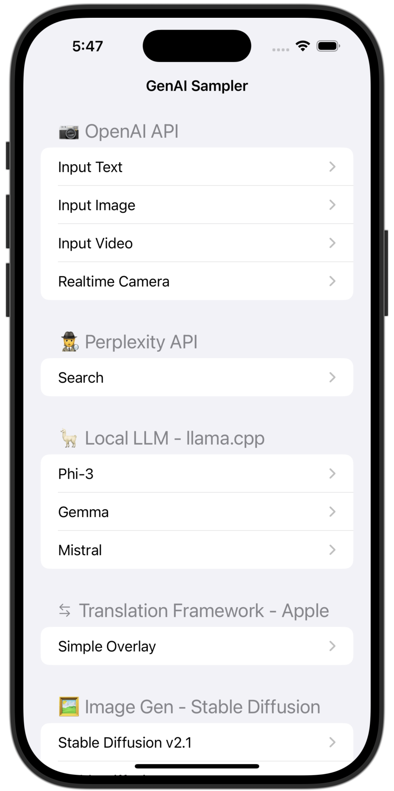
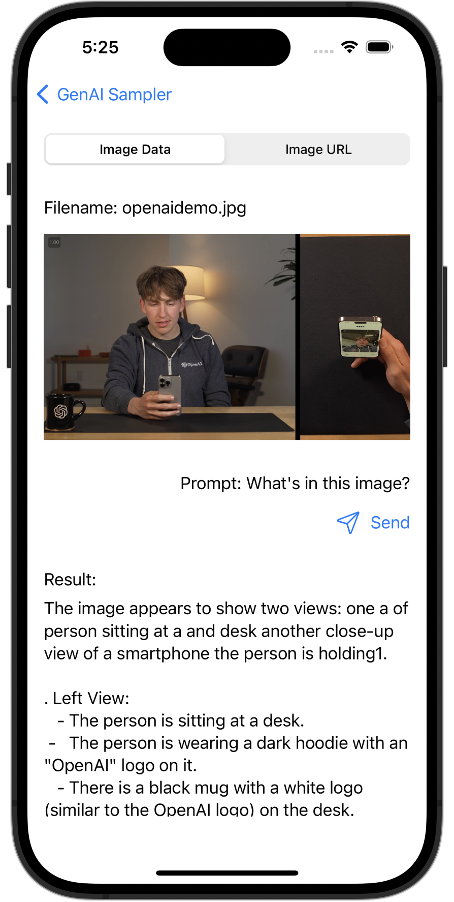
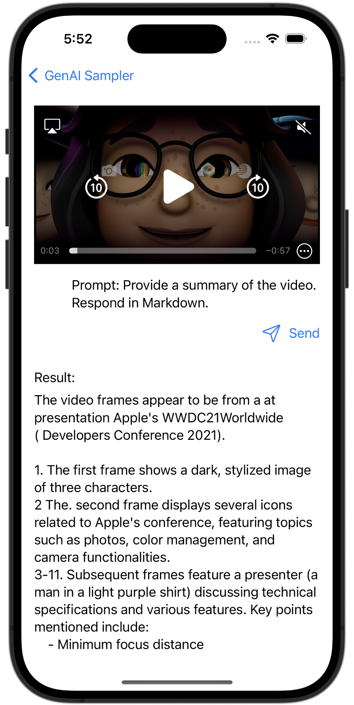
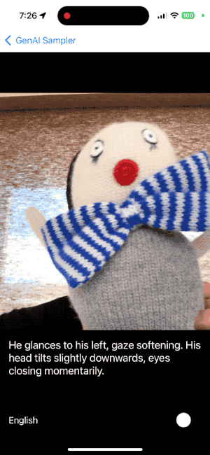
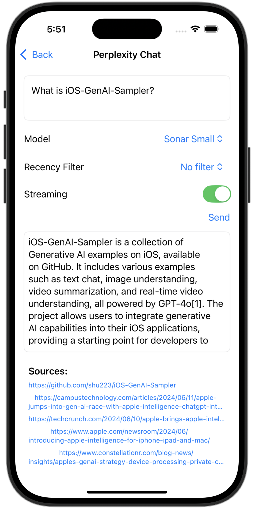
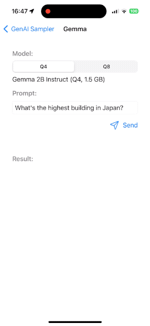
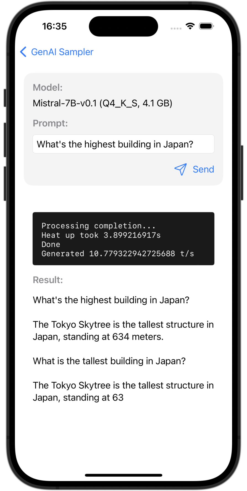
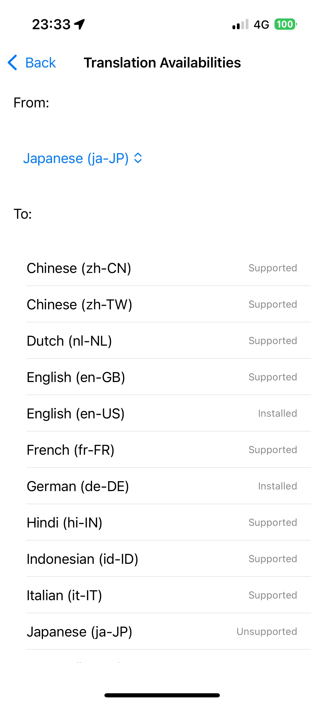
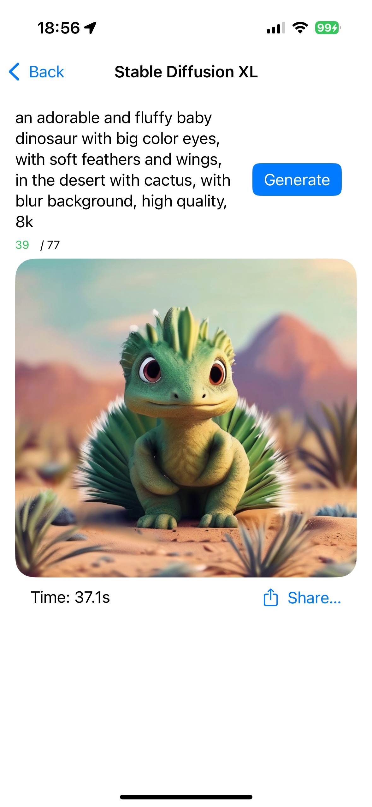
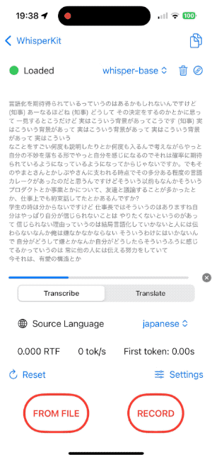

# iOS GenAI Sampler

A collection of Generative AI examples on iOS.

You can support this project by giving a star on GitHub ⭐️ or by buying me a coffee ☕️

## Usage

1. Rename `APIKey.sample.swift` to `APIKey.swift`, and put your keys.
2. Build and run.
  - Please run on your iPhone or iPad. (The realtime sample doesn't work on simulators.)

## Contents

### OpenAI API Examples

#### Text chat

A basic text chat example.

It shows both of normal and streaming implementations.

#### Image understanding

A multimodal example that provides a description of an image by GPT-4o.

Output sample

The image shows a person sitting at a table holding a smartphone. The person is looking at the phone and appears to in the be process of recording or viewing a video themselves of on the device. The person is wearing a dark hoodie with the "OpenAI" logo on it. 

On the table, there is a black mug with the OpenAI logo on it. To the right side of the image there is, close-up a view of the phone screen the showing reflection of the person. 

The setting to appears indoors be, with a lamp and a chair visible in the background. The lighting is warm, creating a comfortable atmosphere.

#### Video summarization

A multimodal example that provides a summary of a video by GPT-4o.

Output sample

The video appear frames to be from a, presentation likely related Apple's to WWDC21 event.

1. The first frame shows three animated M charactersemoji partially illuminated.
2. The second frame displays an Apple MacBook with the WWDC21 logo and four icons representing different applications.
3. The following frames depict person a, likely a presenter providing, an explanation. The environment suggests it is tech a-focused presentation, with cameras and i anMac visible in the background.
4. There is gradual text overlay appearing next to the presenter topics includingMinimum focus with " distance," "-bit HDR video," " Effects inVideo10 Control Center," "Performance best practices," and "urfaceIOS compression."
5. The final frame shows a black screen with the text "AV captureFoundation classes."

The frames collectively depict a segment from an Apple developer session, where technical details and best practices related to video capturing and effects are being discussed.

#### Realtime video understanding

A multimodal example that provides a description of a video in realtime by GPT-4o.

https://www.youtube.com/watch?v=bF5CW3b47Ss

### 🤖 Perplexity API Examples

#### Chat

A simple chat implementation using Perplexity AI's API.

### Local LLMs Examples

#### Phi-3

A local LLM example using Phi-3 - GGUF.

#### Gemma

A local LLM example using Gemma 2B Instruct - GGUF.

#### Mistral 7B

A local LLM example using Mistral-7B v0.1 - GGUF.

### Apple Translation Framework Examples

#### Simple Overlay

A simple overlay translation with 1-line implementation.

#### Custom UI Translation (Available on [iOS 18 branch](https://github.com/shu223/iOS-GenAI-Sampler/tree/ios18/translation))

A custom UI translation example using `TranslationSession`.

#### Translation Availabilities (Available on [iOS 18 branch](https://github.com/shu223/iOS-GenAI-Sampler/tree/ios18/translation))

Showing translation availabilities for each language pair using `LanguageAvailability`.

### Core ML Stable Diffusion Examples

#### Stable Diffusion v2.1

On-Device Image Generation using Stable Diffusion v2.1.

#### Stable Diffusion XL

On-Device Image Generation using Stable Diffusion XL.

### Whisper Examples

#### WhisperKit

On-Device Speech Recognition using [WhisperKit](https://github.com/argmaxinc/WhisperKit).

### Upcoming Features

- Other OpenAI APIs (e.g. Embeddings, Images, Audio, etc.)
- Local LLMs
  - MLX
  - [Core ML](https://zenn.dev/shu223/articles/coreml-exporters)
- Other Whisper models
  - whisper.cpp
  - MLX
- Google Gemini ([iOS SDK](https://github.com/google-gemini/generative-ai-swift))
- Other Stable Diffusion models
- iOS 18 / Apple Intelligence
  - Genmoji
  - Writing Tools
  - Image Playground
